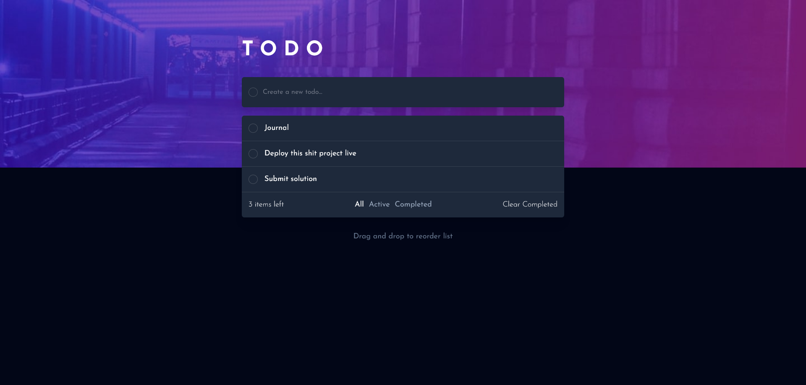

# Frontend Mentor - Todo app solution

This is a solution to the [Todo app challenge on Frontend Mentor](https://www.frontendmentor.io/challenges/todo-app-Su1_KokOW). Frontend Mentor challenges help you improve your coding skills by building realistic projects. 

## Table of contents

- [Overview](#overview)
  - [The challenge](#the-challenge)
  - [Screenshot](#screenshot)
  - [Links](#links)
- [My process](#my-process)
  - [Built with](#built-with)
  - [What I learned](#what-i-learned)
  - [Continued development](#continued-development)
  - [Useful resources](#useful-resources)
- [Author](#author)
- [Acknowledgments](#acknowledgments)


## Overview

### The challenge

Users should be able to:

- View the optimal layout for the app depending on their device's screen size
- See hover states for all interactive elements on the page
- Add new todos to the list
- Mark todos as complete
- Delete todos from the list
- Filter by all/active/complete todos
- Clear all completed todos
- Toggle light and dark mode
- **Bonus**: Drag and drop to reorder items on the list

### Screenshot



### Links

- Solution URL: [Add solution URL here](https://your-solution-url.com)
- Live Site URL: [Add live site URL here](https://your-live-site-url.com)

## My process

### Built with

- Semantic HTML5 markup
- CSS custom properties
- Flexbox
- CSS Grid
- Mobile-first workflow
- [React](https://reactjs.org/) - JS library
- [Next.js](https://nextjs.org/) - React framework
- [Tailwind](https://tailwindcss.com/docs/) - Utility class library
- [react-movable](https://github.com/tajo/react-movable/) - Drag and drop library


### What I learned

#### Prisma

There are the Prisma commands I used to set up Prisma as my ORM to create schemas for my small database. 

After installing Prisma as one of my devDependencies using `npm install prisma --save-dev`. I initialised it on my project using this command: 

```js
npx prisma init
```

After this command, schema.prisma file along with an .env file have been generated to the project. Coming to create this project I am struggling to grasp the DATABASE_URL contents, but using this image from MongoDB, I somehow got the idea of each segment of DATABASE_URL:


Next thing I learned is how to create database model:

```js
generator client {
  provider = "prisma-client-js"
}

datasource db {
  provider = "mongodb"
  url      = env("DATABASE_URL")
}

enum Status {
  active
  completed
}

model Todo {
  id            String   @id @default(auto()) @map("_id") @db.ObjectId
  title         String
  status        Status
  dateCreated   DateTime
}
```

After creating my Todo model, next thing I did is to push it to my MongoDB server.

```js
npx prisma db push
```
---

### NextJS Server Action

Moving forward to using NextJS server actions, I fetched my `todos` also using Prisma by this code:

```js
///fetchTodo.js

"use server";

import { PrismaClient } from "@prisma/client";
const prisma = new PrismaClient();

export async function fetchTodo() {
  try {
    return await prisma.todo.findMany();
  } catch (error) {
    console.log(error);
  } finally {
    await prisma.$disconnect();
  }
}

```
---
#### useFormState() and useFormStatus()

I also got to learn how to use the `useFormState()` hook from React. 

```js
export default function TodoForm() {
  const [todo, setTodo] = useState("");
  const [success, formAction] = useFormState(handleSubmit, null);

  async function handleSubmit() {
    try {
      await createTodo(todo);
      setTodo("")
      return "Success";
    } catch (error) {
      return "Error has occured";
    }
  }

  return (
    <form
      action={formAction}
    >
```

Aside from `useFormState()` I also implemented using the `useFormStatus()` for my button component when the form is submitted.

```js
function Submit() {
  const { pending } = useFormStatus();

  return (
    <button
      type="submit"
      disabled={pending}
      className="
      text-slate-700
      dark:text-slate-50
      hidden
      "
    >
      {pending ? "Submitting..." : "Submit"}
    </button>
  );
}
```

In this, I have some progress learning React with TypeScript in some instance such as the type of the props:

```js
type Todo = {
  id: string;
  title: string;
  status: string;
  dateCreated: Date;
};

type TodoProps = {
  todoList: Todo[];
};

export default function TodoList({ todoList }: TodoProps){
  // code here
}
```
---

#### Tailwind

This is also my first time using Tailwind on a React project. I am surprised with how efficient it is for making responsive inline class styles possible, as well as using setting a theme inline:

```css
  dark:sm:bg-desktop-dark
  bg-mobile-light   
  dark:bg-mobile-dark    
  bg-white
  dark:bg-slate-950
```

### Continued development

On my next project I am going to use the following technologies:

- NextJS Internationalization.
- TypeScript (Type vs Interface)
- Study the middleware.ts
- useMemo()
- createContext() and useContext()

## Author

- Portfolio - [Project Portfolio](https://loifloro.github.io/portfolio/)
- Frontend Mentor - [@loifloro](https://www.frontendmentor.io/profile/loifloro)
- LinkedIn - [@jlfloro](https://www.linkedin.com/in/jlfloro/)


## Acknowledgments

I would like to thank Sir Jimmy for challenging me to be a better developer, by that I think create weekly solutions for Frontend Mentor to try new things. 
